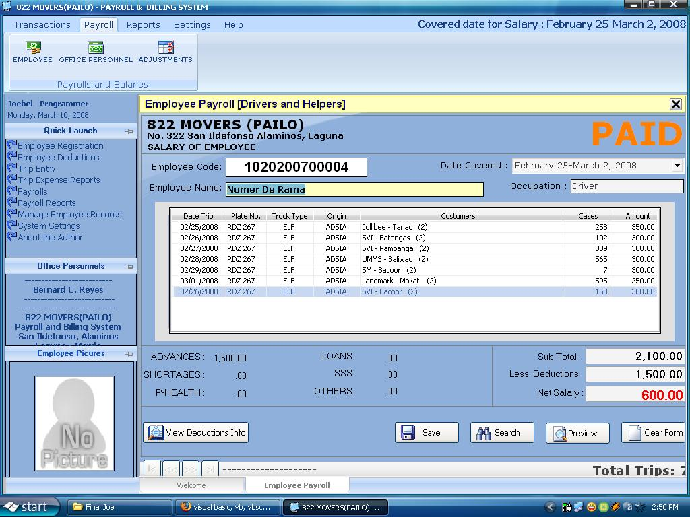



## Payroll and Truck Trip Monitoring System of PAILO trucking Corporation

### Description

This is a compelte Payroll and trip monitoring system of Trucking Company. Manage report, all trip data, Graphical design view and friendly user.....
 
### More Info
 
no inputs

no returns

no sode effects

             |
---                |---
**Submitted On**   |2008-03-10 14:52:18
**By**             |[Joehel V\. del Rosario](https://github.com/Planet-Source-Code/PSCIndex/blob/master/ByAuthor/joehel-v-del-rosario.md)
**Level**          |Advanced
**User Rating**    |4.7 (56 globes from 12 users)
**Compatibility**  |VB 5\.0, VB 6\.0, VBA MS Access
**Category**       |[Complete Applications](https://github.com/Planet-Source-Code/PSCIndex/blob/master/ByCategory/complete-applications__1-27.md)
**World**          |[Visual Basic](https://github.com/Planet-Source-Code/PSCIndex/blob/master/ByWorld/visual-basic.md)
**Archive File**   |[Payroll\_an2105613112008\.zip](https://github.com/Planet-Source-Code/joehel-v-del-rosario-payroll-and-truck-trip-monitoring-system-of-pailo-trucking-corporatio__1-70245/archive/master.zip)

### API Declarations

This is a compelte Payroll and trip monitoring system of Trucking Company. Manage report, all trip data, Graphical design view and friendly user.....

